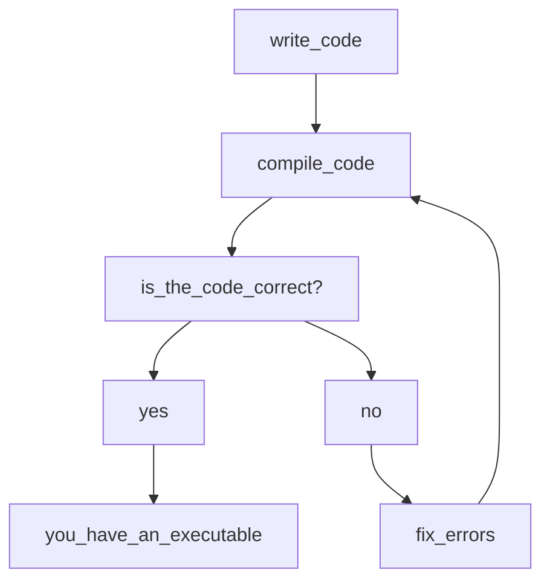

# Workflow in a compiled language

C++ is a statically typed strong compiled high level language, if your new to computer programming this all sounds like jargon so what does all of this mean?

In this course you will find answers to this question and much more, lets start with high level what this means is that the language is independent from the computer architecture its run

For generating a c++ executable there is a series of steps and software that is required, more generally the general steps are
as folllows:



For this to be possible a number of software tools are required, for purposes of this section we will concern ourselves with the compiler and the linker.

# What is a compiler

According to Laplante "he compiler bridges the semantic gap between the
high-level program that the user requires to be executed
and the low-level instructions that a computer can understand" [[1]](1) in other words the compiler translates to a lower level language which in this case is specific to a specified architecture (x86 for our purposes), a linker concerns itself with linking the different files that are used by our program (more or less). For simplicity the compiler that we will be using is the GCC compiler.

# Setting up gcc.

Asuming your using ubuntu (as it is a requirement), you want to execute the following commands in order:
```bash
sudo apt-get update && sudo apt-get upgrade
sudo apt-get install gcc g++
```
If you encounter troubles in your installation your encouraged to read the output of the shell, as it will give you hints should this not work.

# Our first program

In this folder create a new folder called test (this folder will be ignored by git), inside it create a file called main.cpp (it is customary for the main entry point of a c++ program to be called main), source code for cpp programs is found in files with the following extensions .cpp and .hpp the second refering to header files which we will talk about briefly, for now write the following onto the file
```cpp
#include <iostream>

int main(){
	std::cout << "Hello world";
	return 0;
}
```
Following this execute the following on your terminal
```bash
g++ main.cpp -o main
ls -lah
```
You will notice that a new file is inside your folder which is the binary executable that corresponds to the program,
also pay attention to the first column the letters correspond to the type of operations that can be perfomed on the file
you can find more about this in  here [[2]](2)
Now type the following in your terminal.
```bash
./main
```
You should get the following output "Hello world", notice that the first line has the following ```#include <iostream>``` with this we are telling
our program to call the header iostream from the c++ standard library.

# Linking our first custom header.

## References
<a id="1">[1]</a>
Philllip A. Laplante
Enciclopedia of Computer Science and Technology Second Edition Volume I, p233.

<a id="2">[2]</a>
https://www.guru99.com/file-permissions.html .
