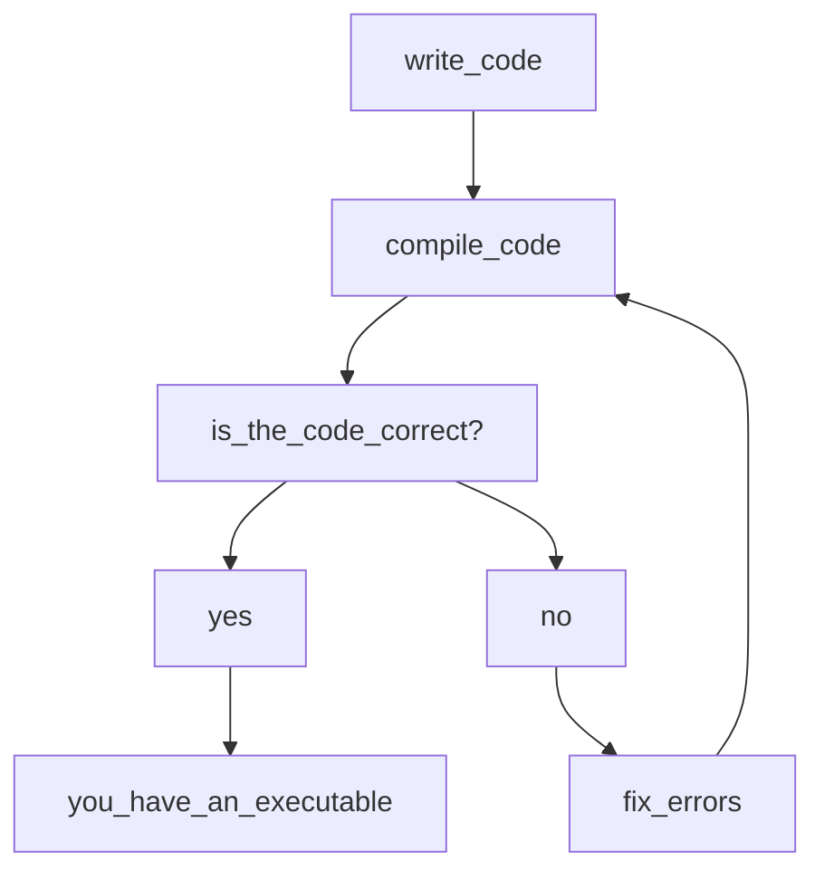

# Workflow in a compiled language

C++ is a statically typed strong compiled high level language, if you are new to computer programming this all sounds like jargon so what does all of this mean?

In this course you will find answers to this question and much more, let's begin with an overview. What this means is that the language is independent of the computer architecture it runs on.

In order to generate a C++ executable there is a series of steps and software that is required, the general steps are:



Several software tools are necessary to make this achievable. For the purposes of this section we will concern ourselves with the compiler and the linker.

# What is a compiler

According to Laplante "the compiler bridges the semantic gap between the high-level program that the user requires to be executed and the low-level instructions that a computer can understand" [[1]](1) in other words the compiler translates to a lower level language which in this case is specific to a specified architecture (x86 for our purposes), a linker concerns itself with linking the different files that are used by our program (more or less). For simplicity the compiler that we will be using is the GCC compiler.

# Setting up gcc.

Asuming you are using ubuntu (as it is a requirement), open a new terminal window and type the following commands in order:
```bash
sudo apt-get update && sudo apt-get upgrade
```
```bash
sudo apt-get install gcc g++
```
If you encounter any troubles with your installation, you are encouraged to read the output of the shell, as it will give you hints of why the process did not work.

# Clone the repository
We will asume that you cloned this repository in the following directory: `~/Documents/GitHub/`

In the terminal window you have opened or in a new window, nagivate the cloned repository 
```bash
cd ~/Documents/GitHub/cpp-_with_meson
```

# Our first program

* In the **unit_1** folder, create a new folder called "test" (this folder will be ignored by git).
* Inside the test folder, create a file called main.cpp (In C++ programming, it is a convention to name the primary access point of a program as "main").
* The source code for cpp programs is usually found in files with the following extensions: .cpp and .hpp (.hpp refers to the header files which we will talk about briefly).
* For now, let's write the following to the file main.cpp
```cpp
#include <iostream>

int main(){
	std::cout << "Hello world!";
	return 0;
}
```
* Save the changes and open the terminal.
* Navigate to the "test" folder `cd ~/Documents/GitHub/cpp-_with_meson/test`
* Now type the following command on your terminal window:
```bash
g++ main.cpp -o main
```
This command will compile the code you have written inside main.cpp.

* Then in order to see the files inside the test folder type the command `ls -lah`.

You will notice that a new file has been created inside your folder. This is the binary executable that corresponds to the program. Also pay attention to the first column the letters correspond to the type of operations that can be perfomed on the file you can find more about this in  here [[2]](2)

* Now type the following on your terminal in order to execute the main program.
```bash
./main
```
You should get the following output **Hello world!**

## Checking the program
```cpp
#include <iostream>

int main(){
	std::cout << "Hello world!";
	return 0;
}
```
* Notice that the first line has the following ```#include <iostream>```. This line tells
our program to call the header iostream from the C++ standard library.
* The second line `int main(){` represents where the program will start executing.
* The next line `std::cout << "Hello world!";` prints the phrase **Hello world!** on the terminal console.
* The next line `return 0` tells the program where to stop.
* Final line `}` closes the main program. Notice that in the second line the main code was opened with the `{` symbol.

# Linking our first custom header.

## References
<a id="1">[1]</a>
Philllip A. Laplante
Enciclopedia of Computer Science and Technology Second Edition Volume I, p233.

<a id="2">[2]</a>
https://www.guru99.com/file-permissions.html .
