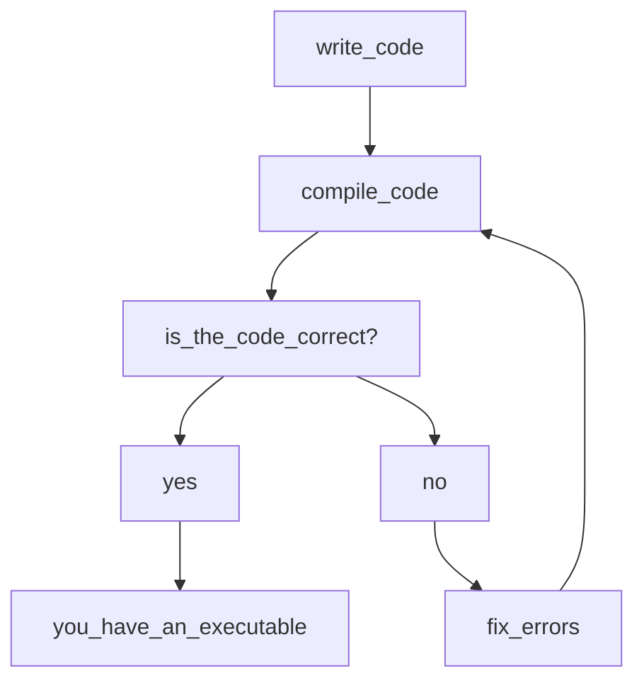

# Workflow in a compiled language
C++ is a statically typed strong compiled high level language, if your new to computer programming this all sounds like jargon so what does all of this mean?

In this course you will find answers to this question and much more, lets start with high level what this means is that the language is independent from the computer architecture its run

For generating a c++ executable there is a series of steps and software that is required, more generally the general steps are
as folllows.

For this to be possible a number of software tools are required.
