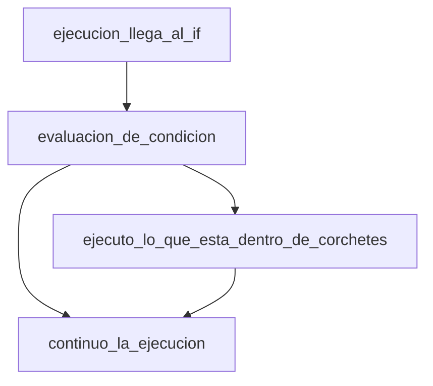
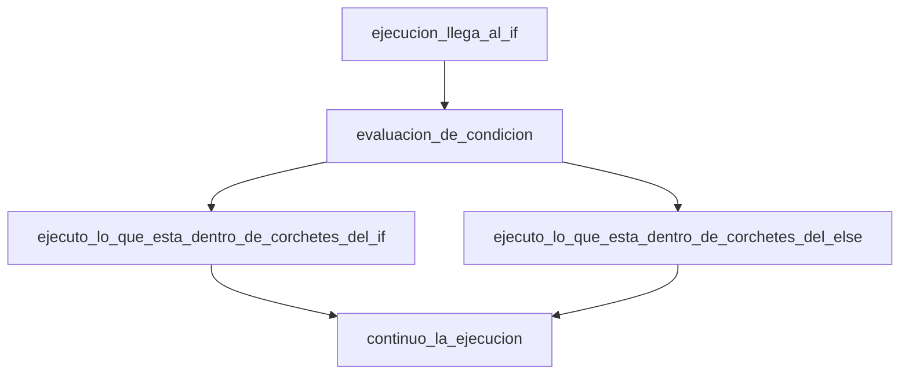
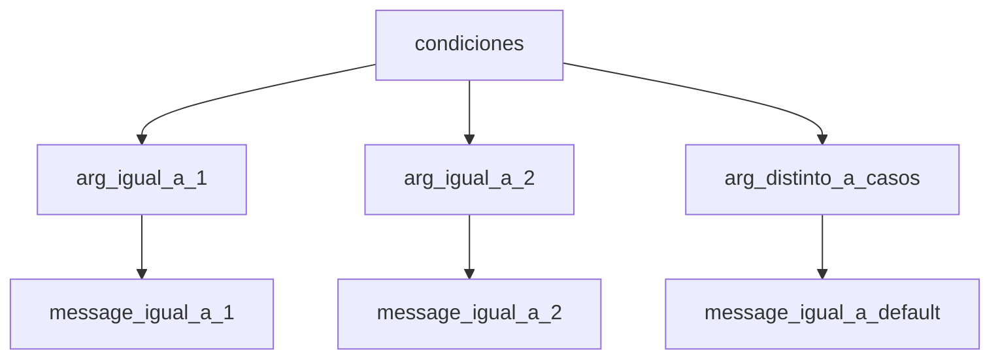

# Estructuras de control

En terminos generales cuando un programa se ejecuta se busca realizar
una serie de ```instrucciones``` en un orden particular, esto en la
literatura recibe el nombre de ```algoritmo``` si el lector esta interesado
un tratamiento formal del tema puede ser encontrado en [[1]](1).

Esta unidad describira lo que se conoce como estructuras de control,
estas son una pieza fundamental en la implementacion de los algoritmos
para cualquier lenguaje de programacion.

# Tipos de estructuras de control

Los tipos de estructuras de control pueden ser divididas en dos tipos
```seleccion``` y ```repeticion``` su representacion en el lenguaje
esta dada por palabras especiales que examineramos a continuacion.

# Estructuras de seleccion

## if

Considere el siguiente codigo:

```cpp

#include <iostream>

int main(){
	bool flag = false;

	if(flag){
		std::cout << "Me ejecuto cuando flag es verdadero." << std::endl;
	}
	return 0;
}

```
Este codigo no despliega ningun valor sin embargo si el valor de flag
pasa de falso a verdadero su salida es la siguiente:

```bash
Me ejecuto cuando flag es verdadero.
```
El if recibe el nombre de condicional y mueve la ejecucion al contexto definido
entre los corchetes si la condicion entre sus parentesis.



## if/else
El if posee una version extendida que se presenta a continuacion:

```cpp

#include <iostream>

int main(){
	bool flag = false;

	if(flag){
		std::cout << "Me ejecuto cuando flag es verdadero." << std::endl;
	}else{
		std::cout << "Me ejecuando cuando flag es falso." << std::endl;
	}

	return 0;
}

```



Esta sintaxis es la habitual sin embargo existen los conocidos como operadores
ternarios que cumplen una funcion similar al if pero se usan en la asignacion
de valores a una variable, antes de mostrar un ejemplo de esto se presentaran
algunos de los operadores necesarios para construir expresiones logicas (una descripcion exhaustiva de los operadores disponibles para expresiones logicas puede ser consultado en [[2]](2) y  [[3]](3))

### Operadores para expresiones logicas

```
Igualdad
==
Desigualdad
!=
Mayor
<
Menor
>
Mayor o igual
<=
Menor o igual
>=
Y booleano
&&
O booleano
||
Negacion booleana
!

```

A continuacion se presentan algunos ejemplos haciendo uso de
los if:

```cpp
// Las siguientes expresiones logicas son equivalentes
#include <iostream>

int main(){
	bool flag = false;

	if(!flag){
		std::cout << "Me ejecuto cuando flag es falso." << std::endl;
	}

	if(flag!=true){
		std::cout << "Me ejecuando cuando flag es falso." << std::endl;
	}

	if(flag==false){
		std::cout << "Me ejecuto cuando flag es falso." << std::endl;
	}

	return 0;
}

```
El codigo anterior tendria la siguiente salida:

```bash
Me ejecuto cuando flag es falso.
Me ejecuto cuando flag es falso.
Me ejecuto cuando flag es falso.
```

### Operadores ternarios

El operador ternario es similar al if/else anteriormente expuesto,
a continuacion se presenta un ejemplo de su uso.

```cpp
#include <iostream>
#include <string>
int main(){

	std::string message;
	bool flag = true;
	flag ? message = "verdadero" : message = "falso";
	std::cout << message << std::endl;
	return 0;
}
```

La salida del siguiente codigo seria la siguiente:
```bash
verdadero
```
Como se aprecia en el ejemplo los casos de la condicional se separan
por el caracter ':' y el codigo ejecutara la condicion de la izquierda
si la condicion logica expuesta es verdadera, de otro modo se procedera
con el codigo a la derecha.

## switch
La estructura de control switch es utilizada cuando es necesario evaluar
una lista de posibles casos como se muestra a continuacion:
```cpp

#include <iostream>
#include <string>

int main(){

	std::string message;

	int arg = 0;

	switch(arg){
		case 1:
			message = "1";
			break;
		case 2:
			message = "2";
			break;
		default:
			message = "default";
	}
	std::cout << message << std::endl;
	return 0;
}
```
El siguiente diagrama detalla los posibles resultados
segun el valor de 'arg':



Note en la sintaxis la presencia de la palabra ```break```
esta interrumpe la ejecucion al llegar a esa linea en particular
del switch y sale de la ejecucion de los corchetes, esto es
importante dado que de otro modo no importaria el valor de arg
siempre se ejecutaria el caso ```default``` tambien se debe
recalcar que si se hace uso de switch este debe incluir el
caso default.

# Estructuras de repeticion
Las tres estructuras basicas de repeticion en cpp
son el for, while y do while se empezara por el for.
## for
El for loop permite realizar la misma instruccion una cantidad n
de veces, para esta estructura se cuenta con las siguientes variables
que controlan el ```estado``` de la iteracion:
```
expresion inicial
condicion de finalizacion
expresion de actualizacion
```
A continuacion se presenta un ejemplo basico de esta estructura
```cpp

#include <iostream>
#include <string>

int main(){
	int forLimit = 5;
	// int i = 0 corresponde a nuestra expresion inicial
	// i < forLimit corresponde a la condicion de finalizacion
	// i++ corresponde a la expresion de actualizacion
	for(int i = 0; i<forLimit; i++){
		std::cout << i << std::endl;
	}
	return 0;
}

```
La salida de este codigo es la siguiente:
```bash
0
1
2
3
4
```

## while
El while posee una condicion logica que establece si se ejecuta o no,
tome como ejemplo el siguiente codigo note que la condicion es que
conditionArg sea igual a 5.

```cpp
#include <iostream>
#include <string>

int main(){
	int conditionArg = 5;
	// Dato a cambiar dentro del while
	int i = 0;

	while(conditionArg==5){
		std::cout << i << std::endl;
		i++;
		if(i==6){
			conditionArg--;
		}
	}
	std::cout << conditionArg << std::endl;
	return 0;
}
```
En este caso el codigo desplegara los numeros enteros del 0 al 6,
y cuando este llegue a 6 saldra del while para desplegar 4.
Note que si el valor de i no incrementara despues de mostrar su valor
actual el codigo seguiria ejecutandose sin parar, otro aspecto a tomar
en cuenta es que los while son estructuras de repeticion dependientes
de la condicion logica usada en el caso de que esta no sea cierta
el codigo dentro de este no se ejecutara.

## do while
La estructura do while es usada cuando necesitamos al menos
una ejecucion de las instrucciones y no sabemos si la condicion
logica descrita se cumple o no. El do while ejecutara el codigo
y despues de su primera ejecucion verificara el valor de verdad
de la condicion, si este es verdadero continuara con otra iteracion
hasta que su condicion sea falsa.

```cpp

#include <iostream>
#include <string>

int main(){
	int conditionArg = 0;
	do{
		std::cout << "Evaluando condicion" << std::endl;
		if(conditionArg==5){
			std::cout << "Condicion falsa." << std::endl;
		}
		std::cout << "Condicion cierta." << std::endl;
		// incremento de conditionArg
		conditionArg++;
	}while(conditionArg!=5);
	std::cout << conditionArg << std::endl;
	return 0;
}
```
La salida del codigo seria la siguiente:

```bash
Evaluando condicion
Condicion cierta.
Evaluando condicion
Condicion cierta.
Evaluando condicion
Condicion cierta.
Evaluando condicion
Condicion cierta.
Evaluando condicion
Condicion cierta.
5
```

# Comentarios finales.

En esta seccion no se examino el comportamiento de
palabras designadas del lenguaje cpp para interrumpir
el comportamiento de las estructuras de repeticion,
en particular ```continue``` y ```break``` se recomienda
al lector estudiar esto por su cuenta.

# Referencias

<a id="1">[1]</a>
Philllip A. Laplante
Enciclopedia of Computer Science and Technology Second Edition Volume II, p110.

<a id="2">[2]</a>
https://www.cs.fsu.edu/~myers/c++/notes/control1.html

<a id="3">[3]</a>
https://en.cppreference.com/w/cpp/language/expressions
