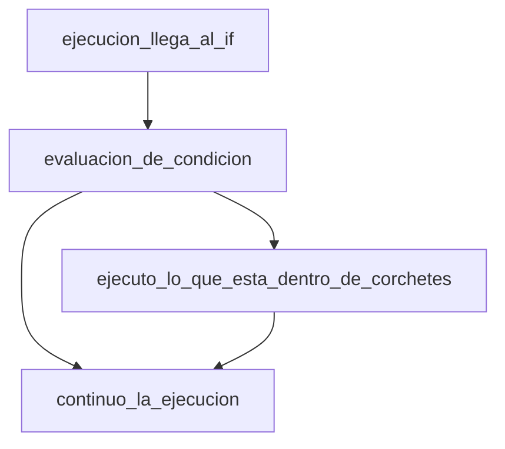
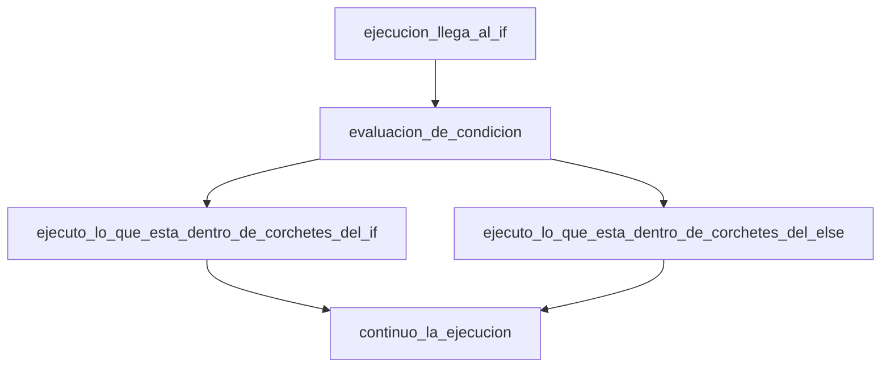

# Estructuras de control

En terminos generales cuando un programa se ejecuta se busca realizar
una serie de ```instrucciones``` en un orden particular, esto en la
literatura recibe el nombre de ```algoritmo``` si el lector esta interesado
un tratamiento formal del tema puede ser encontrado en [[1]](1).

Esta unidad describira lo que se conoce como estructuras de control,
estas son una pieza fundamental en la implementacion de los algoritmos
para cualquier lenguaje de programacion.

# Tipos de estructuras de control

Los tipos de estructuras de control pueden ser divididas en dos tipos
```seleccion``` y ```repeticion``` su representacion en el lenguaje
esta dada por palabras especiales que examineramos a continuacion.

# Estructuras de seleccion

## if

Considere el siguiente codigo:

```cpp

#include <iostream>

int main(){
	bool flag = false;

	if(flag){
		std::cout << "Me ejecuto cuando flag es verdadero." << std::endl;
	}
	return 0;
}

```
Este codigo no despliega ningun valor sin embargo si el valor de flag
pasa de falso a verdadero su salida es la siguiente:

```bash
Me ejecuto cuando flag es verdadero.
```
El if recibe el nombre de condicional y mueve la ejecucion al contexto definido
entre los corchetes si la condicion entre sus parentesis.



## if/else
El if posee una version extendida que se presenta a continuacion:

```cpp

#include <iostream>

int main(){
	bool flag = false;

	if(flag){
		std::cout << "Me ejecuto cuando flag es verdadero." << std::endl;
	}else{
		std::cout << "Me ejecuando cuando flag es falso." << std::endl;
	}

	return 0;
}

```



Esta sintaxis es la habitual sin embargo existen los conocidos como operadores
ternarios que cumplen una funcion similar al if pero se usan en la asignacion
de valores a una variable, antes de mostrar un ejemplo de esto se presentaran
algunos de los operadores necesarios para construir expresiones logicas (una descripcion exhaustiva de los operadores disponibles para expresiones logicas puede ser consultado en [[2]](2) y  [[3]](3))

### Operadores para expresiones logicas

```
Igualdad
==
Desigualdad
!=
Mayor
<
Menor
>
Mayor o igual
<=
Menor o igual
>=
Y booleano
&&
O booleano
||
Negacion booleana
!

```

A continuacion se presentan algunos ejemplos haciendo uso de
los if:

```cpp
// Las siguientes expresiones logicas son equivalentes
#include <iostream>

int main(){
	bool flag = false;

	if(!flag){
		std::cout << "Me ejecuto cuando flag es falso." << std::endl;
	}

	if(flag!=true){
		std::cout << "Me ejecuando cuando flag es falso." << std::endl;
	}

	if(flag==false){
		std::cout << "Me ejecuto cuando flag es falso." << std::endl;
	}

	return 0;
}

```
El codigo anterior tendria la siguiente salida:

```bash
Me ejecuto cuando flag es falso.
Me ejecuto cuando flag es falso.
Me ejecuto cuando flag es falso.
```

### Operadores ternarios


## switch

```cpp

#include <iostream>
#include <string>

int main(){

	return 0;
}

```

# Estructuras de repeticion

## for

```cpp

#include <iostream>
#include <string>

int main(){

	return 0;
}

```

## while

```cpp

#include <iostream>
#include <string>

int main(){

	return 0;
}

```

## do while

```cpp

#include <iostream>
#include <string>

int main(){

	return 0;
}

```

# Referencias

<a id="1">[1]</a>
Philllip A. Laplante
Enciclopedia of Computer Science and Technology Second Edition Volume II, p110.

<a id="2">[2]</a>
https://www.cs.fsu.edu/~myers/c++/notes/control1.html

<a id="3">[3]</a>
https://en.cppreference.com/w/cpp/language/expressions
